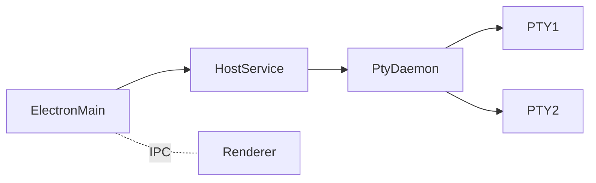

# Daemon Packaging & Long-Term Sessions

Reference for Flux's session daemon: how it is packaged today, why packaged
builds were failing to start sessions, the fix landed in Phase A+B, and the
full Superset-aligned playbook for the eventual fd-handoff migration
(Phases C+D). Cite this doc when discussing or modifying anything under
`src/daemon/`, `src/main/DaemonClient.ts`, `vite.daemon.config.ts`,
`forge.config.ts`, or `runtime-dependencies.ts`.

## Why this doc exists

The Flux daemon runs as a separate Node process (`ELECTRON_RUN_AS_NODE=1`,
detached) so PTY sessions survive `cmd-Q` and Electron crashes. It speaks
NDJSON over two unix sockets (RPC + stream) to the Electron main process.
See `src/daemon/protocol.ts` and `src/daemon/daemon.ts`.

That architecture works fine in dev but had a packaging bug that silently
broke session creation in packaged builds. The fix (Phase A+B) was modelled
after [Superset's pty-daemon](https://github.com/superset-sh/superset).
The same playbook also gives us, as later phases, supervised restarts and
session-preserving daemon-binary upgrades.

## 1. Current Flux state (post Phase A+B)

### Build outputs

`forge.config.ts` registers `src/daemon/daemon.ts` as a Vite entry, emitted
next to `main.js`/`preload.js` at `.vite/build/daemon.js`. `vite.daemon.config.ts`
keeps native and asar-unfriendly modules external:

```ts
external: ['electron', ...daemonExternals]
// daemonExternals: ['node-pty', '@xterm/headless', '@xterm/addon-serialize']
```

### Packaged layout (macOS)

```
Flux.app/Contents/
  MacOS/Flux                                  (Electron binary)
  Resources/
    app.asar                                  (renderer + main only)
    app.asar.unpacked/                        (auto-unpack-natives writes *.node here)
    daemon/                                   (Phase A: outside asar entirely)
      daemon.js
      daemon.js.map?
      node_modules/
        node-pty/                             (full tree; spawn-helper + pty.node both executable)
        @xterm/headless/
        @xterm/addon-serialize/
```

The daemon is spawned by `DaemonClient.spawnDaemon()` in
[src/main/DaemonClient.ts](../src/main/DaemonClient.ts) with
`ELECTRON_RUN_AS_NODE=1`, `detached: true`, `stdio: 'ignore'`, and `.unref()`.
The script path is resolved by `resolveDaemonScriptPath()`:

1. `path.join(process.resourcesPath, 'daemon', 'daemon.js')` — packaged.
2. `path.join(__dirname, 'daemon.js')` — dev (sibling of `main.js`).
3. `path.resolve(process.cwd(), '.vite/build/daemon.js')` — last-ditch fallback.

### Single source of truth: `runtime-dependencies.ts`

[runtime-dependencies.ts](../runtime-dependencies.ts) lists every external
the daemon needs and where it should land in the packaged tree. It is the
**only** place that needs to change to add a daemon dep. Three consumers
read it:

- `vite.daemon.config.ts` → `rollupOptions.external` so the bundler does not
  inline these modules.
- `forge.config.ts` `packageAfterCopy` hook → stages `Resources/daemon/`
  by copying `node_modules/<specifier>` for each entry.
- `forge.config.ts` `packagerIgnore` → no longer needs a `node_modules` allowlist
  (the daemon's deps live outside the asar now), so it ignores everything
  except `.vite/` and `package.json`.

This mirrors Superset's [apps/desktop/runtime-dependencies.ts](https://github.com/superset-sh/superset/blob/main/apps/desktop/runtime-dependencies.ts).

## 2. The bug Phase A fixed (root cause)

`node-pty@1.x` on macOS forks via an external `spawn-helper` Mach-O binary
that lives at `node_modules/node-pty/build/Release/spawn-helper`. The
forked process then `posix_spawnp`s the user's shell.

**Failure path (pre-Phase A):**

- Forge's `AutoUnpackNativesPlugin` unpacks any `*.node` file into
  `Resources/app.asar.unpacked/`, but **only `*.node`**. The companion
  `spawn-helper` (no extension) stayed inside `app.asar`.
- `forge.config.ts` had a manual `asarUnpack: ['**/*.node', '**/node_modules/node-pty/**']`
  that was supposed to unpack the rest of node-pty too, but in practice
  the auto-unpack plugin's output won the merge and only `pty.node` ended
  up in `app.asar.unpacked`.
- When the daemon called `pty.spawn(...)`, node-pty tried to `posix_spawnp`
  the in-asar `spawn-helper` path. `posix_spawnp` cannot execute a file
  inside the asar archive (it is not a real file on disk), so it returned
  ENOENT and node-pty surfaced `posix_spawnp failed`. The daemon reported
  `AGENT_NOT_FOUND` over RPC and the renderer never saw a working PTY.

**How to reproduce (kept here in case a future packaging regression mimics this):**

```sh
mkdir -p /tmp/flux-daemon-test
ELECTRON_RUN_AS_NODE=1 FLUX_DAEMON_USER_DATA=/tmp/flux-daemon-test \
  ./out/Flux-darwin-arm64/Flux.app/Contents/MacOS/Flux \
  ./out/Flux-darwin-arm64/Flux.app/Contents/Resources/app.asar/.vite/build/daemon.js &
# wait a moment, then send an NDJSON hello + createSession over the RPC socket
# under /var/folders/.../T/flux-daemon-*/flux-daemon.rpc.sock.
# The reply contains `"error":"AGENT_NOT_FOUND","message":"posix_spawnp failed."`.
```

**Why Phase A fixes it definitively:**

- The daemon binary itself and the full `node-pty` tree live under
  `Contents/Resources/daemon/` as real files on the filesystem. No asar
  involvement. `spawn-helper` is a normal executable. `posix_spawnp` is happy.
- `@xterm/headless@6.0.0`'s broken `module` field stops mattering because
  the daemon resolves it from a regular `node_modules` directory and Vite
  has an alias defense for any future re-resolution path.
- Electron's asar integrity validation (`EnableEmbeddedAsarIntegrityValidation`
  fuse) no longer participates in daemon startup either.

## 3. Superset cross-reference

Superset's playbook is what Phase A+B (and the planned C+D) emulates. The
files below are useful when reviewing changes here.

| Concern | Superset file | Notes |
|---|---|---|
| Manifest of external runtime modules | [`apps/desktop/runtime-dependencies.ts`](https://github.com/superset-sh/superset/blob/main/apps/desktop/runtime-dependencies.ts) | `externalizedRuntimeModules` + `mainExternalizedDependencies` + `packagedNodeModuleCopies` + `packagedAsarUnpackGlobs`. Flux's `runtime-dependencies.ts` is the same idea in smaller form. |
| Sister-bundle daemon entry in Vite | [`apps/desktop/electron.vite.config.ts`](https://github.com/superset-sh/superset/blob/main/apps/desktop/electron.vite.config.ts) (search "pty-daemon") | Daemon is one rollup `input` next to `index`, emitted in the same `dist/main/` dir. Flux's `forge.config.ts` uses three Forge/Vite `build` entries and produces the same layout. |
| `@xterm/headless@6` `module` field workaround | Same file, `resolve.alias` | Mirrored in our `vite.daemon.config.ts`. |
| Daemon package itself | [`packages/pty-daemon/src/main.ts`](https://github.com/superset-sh/superset/blob/main/packages/pty-daemon/src/main.ts), [`packages/pty-daemon/build.ts`](https://github.com/superset-sh/superset/blob/main/packages/pty-daemon/build.ts), [`packages/pty-daemon/README.md`](https://github.com/superset-sh/superset/blob/main/packages/pty-daemon/README.md) | Bundled with Bun, target `node`, externals only for `node-pty`. Phase D (handoff) lives in `runHandoffReceiver` here. |
| Supervisor: spawn, adopt, restart, crash-circuit, version-probe, handoff orchestration | [`packages/host-service/src/daemon/DaemonSupervisor.ts`](https://github.com/superset-sh/superset/blob/main/packages/host-service/src/daemon/DaemonSupervisor.ts) | This is what `DaemonClient` becomes if Flux pursues Phase C. |
| Detached spawn from the Electron main process | [`apps/desktop/src/main/lib/host-service-coordinator.ts`](https://github.com/superset-sh/superset/blob/main/apps/desktop/src/main/lib/host-service-coordinator.ts) | Same `spawn(process.execPath, …, { detached: true })` pattern Flux uses, with explicit dev vs. prod stdio handling (file-backed in prod so the detached child cannot lose stdio when the parent dies). |

## 4. Why the runtime layout is what it is

### Why outside the asar (not just asar-unpack)

Both approaches work. We picked "extra resource" (real files under
`Resources/daemon/`) over asar-unpack because:

1. **Correctness margin** — asar-unpack globs are fragile: Forge's
   `AutoUnpackNativesPlugin` already proved it can override manual
   `asarUnpack` entries and miss helper binaries (`spawn-helper`).
   Extra-resource staging is an explicit file-copy that is impossible to
   silently downgrade.
2. **Faster cold-spawn** — with `EnableEmbeddedAsarIntegrityValidation: true`,
   inside-asar reads pay an integrity check on every file. The daemon's
   require graph (~50 files) traversed outside the asar avoids that. Small
   per-spawn win, but real.
3. **Aligns with the side-binary pattern** — Electron's own helper apps
   ship as separate trees under `Resources/`. Anyone familiar with the
   Electron model recognises `Resources/daemon/` immediately.
4. **Sets up Phase D cleanly** — fd-handoff swaps the daemon binary with
   the user's PTYs still attached. Doing that from a clean
   `Resources/daemon/daemon.js` is much simpler than coordinating with
   `app.asar.unpacked/.vite/build/daemon.js`.

### Why the daemon binary itself goes outside too

The daemon is the only `.js` file in the project that runs in a Node
context separate from Electron's main process. Keeping it inside the
asar adds:

- An integrity-check round-trip on every spawn.
- An implicit dependency on `OnlyLoadAppFromAsar` not breaking RunAsNode.
- A worse story for Phase D (the successor daemon would have to be
  spawned from inside an asar archive that the predecessor might be
  about to unmount/replace).

The cost of moving it is one Vite build copy plus ~120 KB on disk —
negligible.

## 5. Three-tier process topology (Superset's, for reference)

Flux today has two tiers: `Electron main ↔ daemon`. Superset uses three.



- **Electron main**: window/IPC orchestrator only.
- **host-service**: per-org HTTP/tRPC server. Owns business logic. Detached.
- **pty-daemon**: lowest layer; owns PTYs. Detached. Can survive host-service
  *and* its own binary upgrades.

For Flux this is overkill today (no per-org isolation, no multi-tenant
backend), but the supervisor pattern from `DaemonSupervisor` is exactly
what Phase C would add to `DaemonClient`. The third tier (host-service)
is unrelated to long-term sessions; it is about deploying the server side
independently of Electron.

## 6. Adoption manifest pattern (Phase C target)

Flux already has the bones of this — a pid file at `userData/flux-daemon.pid`
plus the unix socket. Superset hardens it with an explicit manifest:

```ts
interface PtyDaemonManifest {
  pid: number;
  socketPath: string;
  protocolVersions: number[];      // for compat
  startedAt: number;
  organizationId: string;          // not needed in single-tenant Flux
  spawnedByAppVersion?: string;    // kill on app upgrade if mismatched
  handoffInProgress?: boolean;     // for Phase D debuggability
}
```

Boot sequence (see Superset's `DaemonSupervisor.tryAdopt`):

1. Read manifest; if missing → spawn fresh.
2. `process.kill(pid, 0)` → if dead → remove manifest, spawn fresh.
3. `net.createConnection(socketPath)` with a 1s timeout → if unreachable →
   `SIGTERM` the pid, remove manifest, spawn fresh ("wedged daemon" case).
4. Send `hello` frame and probe `daemonVersion` from `hello-ack`. If older
   than the bundled daemon, mark `updatePending=true` (UI badge + optional
   auto-update via fd-handoff).
5. Otherwise: adopt. Start a 5s liveness poll (`kill(pid, 0)`) because
   adopted daemons do not give us a `child.on('exit')` handle.

The Flux equivalent today does steps 1-3 implicitly via the
`tryConnectExisting` path in `DaemonClient.ts`. Phase C would make it
explicit and add version detection.

## 7. Phase D — fd-handoff for daemon-binary upgrades

This is the long-term-sessions payoff. With it, shipping a new Flux release
does **not** kill the user's running terminals.

### Protocol sketch (Superset's, [packages/pty-daemon/src/main.ts](https://github.com/superset-sh/superset/blob/main/packages/pty-daemon/src/main.ts))

1. Predecessor receives `prepareUpgrade` RPC from the supervisor.
2. Predecessor `SessionStore.writeSnapshot(snapshotPath)` — serializes
   session metadata (cwd, env, dim, scrollback bytes, agent state).
3. Predecessor `spawn(process.execPath, [daemonScript, '--handoff', '--snapshot=…', '--socket=…'], { stdio: [...ptyMasterFds, 'ipc'] })`.
   Each PTY master fd is inherited by the successor via stdio file
   descriptor inheritance.
4. Successor enters `runHandoffReceiver`:
   - Reads snapshot.
   - `server.adoptSnapshot(snapshot)` — rebuilds in-memory state, wraps
     each inherited fd in a new node-pty-compatible PTY object.
   - `process.send({ type: 'upgrade-ack', successorPid })` over IPC.
   - Waits for the predecessor to call `process.disconnect()` (delivered
     as `'disconnect'` event on this side).
   - `server.listenWithRetry()` — binds the socket. The retry is required
     because the predecessor's `socket.close()` unlinks the path, and we
     race a microsecond window between unlink and our bind.
   - `clearSnapshot(snapshotPath)`.
5. Supervisor polls `kill(predecessorPid, 0)`; on exit it probes the new
   socket for a version handshake (with retry, since the bind window is
   not instant).

### The critical bundler gotcha

The `--handoff` mode signal **must** be on `process.argv`, not in an env
var:

```ts
// CORRECT
if (process.argv.includes('--handoff')) await runHandoffReceiver();

// WRONG — esbuild and Bun statically inline `process.env.X === 'Y'` at
// build time, dead-code-eliminating the receiver branch entirely. Even
// `process.env["KEY"]` bracket notation is seen through. `argv` is
// fully dynamic and survives every bundler we use.
```

Lifted verbatim from Superset's comment in
[`packages/pty-daemon/src/main.ts`](https://github.com/superset-sh/superset/blob/main/packages/pty-daemon/src/main.ts).
Vite/esbuild does the same; Flux will hit this the moment we add a mode
branch to `daemon.ts`.

### Supervisor responsibilities for fd-handoff

- **Coalesce concurrent `update()` calls** — both UI clicks and auto-update
  on adoption can race. Cache the in-flight promise per org.
- **Suppress crash-respawn during handoff** — the predecessor's "expected"
  exit must not be treated as a crash. Superset uses a `stopping` set.
- **Predecessor-exit gating** — do not probe the successor for version
  until `kill(predecessorPid, 0)` returns ESRCH. Otherwise the probe
  hits the still-alive predecessor and records its (old) version.
- **Bind-window retry** — successor calls `listenWithRetry` so the
  ~microsecond window between the predecessor's unlink and the successor's
  bind does not return EADDRINUSE.
- **Manifest mid-handoff flag** — set `handoffInProgress: true` so a
  host-service crash mid-handoff is debuggable; replace or revert on
  success/failure.

## 8. Crash circuit breaker (Phase C addition)

Superset refuses to respawn the daemon after more than 3 crashes within
60 seconds, surfacing a hard error and a UI "Retry" action. See
`DaemonSupervisor.ts`:

```ts
const CRASH_BUDGET = 3;
const CRASH_WINDOW_MS = 60_000;
```

Flux's `DaemonClient.ts` currently has no such guard — a wedged daemon
that crashes on each boot can produce an infinite respawn loop. Phase C
should add this. The pattern is small enough to drop in around
`spawnDaemon()`.

## 9. Stateless protocol design

Superset's `pty-daemon` README:

> Stateless from the client's perspective. Every protocol call carries
> full context. No client tracking, no session tombstones, no business
> rules.

Flux's protocol is mostly there (`createSession` takes the full params,
`attachSession` takes only an `id`), but it does carry session
metadata on the daemon side (`SessionEntry` in `DaemonCore.ts`). When
adding Phase D we should adopt the stateless-client invariant explicitly
so the snapshot/restore code does not have to chase implicit state.

## 9b. The macOS GUI launchd-PATH problem (`userShellEnv.ts`)

Phase A made the daemon spawn correctly in packaged builds. The day we
shipped that, planning sessions started failing immediately with
"This planning session has ended" — the daemon was up, but `pty.spawn('agent', ...)`
exited with ENOENT before its first byte of output.

**Root cause:** macOS GUI launches (Finder / Dock / Spotlight / `open(1)`)
inherit launchd's minimal PATH (`/usr/bin:/bin:/usr/sbin:/sbin`). The user's
real PATH (`/opt/homebrew/bin`, `~/.local/bin`, `~/.cargo/bin`, etc.) is set
by `~/.zshrc` and only exists inside interactive shells. The daemon
inherits `process.env.PATH` from the Electron main process, which inherited
it from launchd, so the daemon also sees the minimal PATH. Every CLI agent
(`agent`, `claude`, `codex`, `gh`) lives outside that minimal PATH, so
`posix_spawnp` returns ENOENT, the PTY child exits immediately, and the
daemon reports `planning-exit` with status=error.

**Why Phase A unmasked it:** pre-Phase-A, the daemon never managed to call
`pty.spawn()` at all (`spawn-helper` ENOENT). After Phase A the daemon
finally reaches the spawn call, and *that* spawn fails for a different
ENOENT reason.

**Fix:** `src/main/userShellEnv.ts` probes the user's interactive-login
shell once at startup and merges the result into `process.env` before
`new DaemonClient()` runs. The daemon and all its PTY children then
inherit the corrected PATH for free.

**Pattern source:** Superset's `packages/host-service/src/terminal/clean-shell-env.ts`
(their v2 strict probe). Verbatim port of:
- Sentinel delimiter (`__FLUX_SHELL_ENV_DELIM__`) bracketing the `env` dump,
  so `.zshrc` banners (`oh-my-zsh`, `brew` notices, etc.) cannot corrupt parsing.
- Locked-down spawn env (only 15 bootstrap keys + `DISABLE_AUTO_UPDATE=true`
  + `ZSH_TMUX_AUTOSTART=false`). Prevents `.zshrc` from auto-execing into
  `tmux` (which never exits) or popping update prompts.
- `cwd: $HOME` to dodge `brew`'s "cwd is not readable" abort when Electron
  helpers launched us at `/private/var/...` (Superset issue #4025).
- `detached: true` + `process.kill(-pid, 'SIGKILL')` on 8s timeout so the
  whole process group (.zshrc-spawned nvm, direnv, etc.) dies together
  rather than orphaning grandchildren.
- 60s success cache.

**Difference from Superset's v1 desktop path:** Superset calls
`applyShellEnvToProcess()` fire-and-forget (`void ...`) because their
host-service is spawned much later in startup. Our daemon is spawned in
the same tick as `new DaemonClient()`, so we **synchronously await** the
probe (~300ms cold cost). We also call `augmentPathForMacOS()` as a
defense-in-depth fallback so even if the shell probe fails entirely,
`/opt/homebrew/{bin,sbin}` + `/usr/local/{bin,sbin}` are reachable.

**Why we rolled our own over `sindresorhus/shell-env`:** Superset
themselves rolled their own v2 probe after originally using `shell-env`.
The library lacks the delimiter, the locked env, the `cwd: $HOME`, and
the process-group SIGKILL — every hardening edge case we needed, we'd
have had to layer on top of the library anyway. Owning ~130 lines beats
owning a wrapper plus a transitive dep that has churned through ESM
migrations.

## 9c. PTY terminal-env shape (`terminalEnv.ts`)

A close cousin of the launchd-PATH bug. After the shell-env fix from 9b,
`agent` and `claude` spawned successfully — but their TUIs rendered in
muted ANSI-16 colors with stripped banners, because the daemon's
inherited env was missing `TERM`, `COLORTERM`, `LANG`, and `TERM_PROGRAM`.

`src/daemon/terminalEnv.ts` supplies a curated env applied at every PTY
spawn in `SessionRuntime`. Verbatim port of Superset's
`packages/host-service/src/terminal/env.ts#buildV2TerminalEnv`:

- `TERM=xterm-256color` (replaces node-pty's `name: 'xterm-color'`
  default, which only advertises 8 colors).
- `COLORTERM=truecolor` — claude-code et al. gate 24-bit color on this.
- `LANG` normalized via `normalizeUtf8Locale` — keep inherited locale if
  it is already UTF-8, else fall back to `en_US.UTF-8`. Without UTF-8
  TUIs render box-drawing as `?`.
- `TERM_PROGRAM=kitty` — claude-code only parses kitty CSI-u
  (`\x1b[13;2u` for Shift+Enter) when `TERM_PROGRAM ∈ {kitty, iTerm.app,
  WezTerm, ghostty, WarpTerminal}`. xterm.js already emits the right
  bytes; claiming kitty means they get parsed instead of submitted as
  plain Enter. Quality-of-life fix for multi-line agent input.
- `COLORFGBG=15;0` — dark-theme hint for tools like vim/fzf that
  auto-pick palette variants.

The env is force-overridden regardless of what `spec.env` or
`process.env` already contain — those values are unreliable across the
dev/packaged divide and we want a consistent rendering surface either
way.

## 10. Known gotchas (collected one place)

- **`@xterm/headless@6.0.0` `module` field**: points to a non-existent
  `lib/xterm.mjs`. Alias to `@xterm/headless/lib-headless/xterm-headless.js`.
  See `vite.daemon.config.ts`.
- **`AutoUnpackNativesPlugin` only matches `*.node`**: it will silently
  leave companion binaries (e.g. `spawn-helper`) inside the asar. The
  Phase A fix sidesteps the plugin entirely by moving daemon deps
  outside the asar.
- **Bundler DCE on `process.env.X`**: as above. Mode signals on argv.
- **macOS `sun_path` 104-byte limit**: unix socket paths must stay short.
  Flux already hashes `userData` into `os.tmpdir()` — see
  `daemonUnixSocketPaths` in `src/daemon/protocol.ts`.
- **macOS GUI launchd PATH**: GUI-launched Electron apps inherit
  `/usr/bin:/bin:/usr/sbin:/sbin` only. The daemon and every PTY child
  inherit that minimal PATH unless we explicitly fix it. See section 9b
  above and `src/main/userShellEnv.ts`.
- **PTY terminal-env shape**: packaged GUI launches have no `TERM` /
  `COLORTERM` / `TERM_PROGRAM`, and `LANG=C.UTF-8` (or none). The
  daemon forces a deterministic recipe at every PTY spawn in
  `src/daemon/terminalEnv.ts` so TUIs render the same in dev and
  packaged. See section 9c.
- **`ELECTRON_NO_ATTACH_CONSOLE` leakage**: must be stripped from the
  child env, otherwise the RunAsNode child tries to reinitialise
  Chromium state. Flux already handles this in
  `DaemonClient.spawnDaemon()`.
- **Forge `prune: true` behaviour**: Forge prunes dev-deps from the
  staged `node_modules/`. We currently set `prune: false` because the
  hand-tuned `packagerIgnore` was already filtering. After Phase A+B
  the daemon's deps no longer live inside the staged app, so flipping
  `prune` back to `true` is safe in principle but should be re-checked
  during the smoke test (some renderer/main runtime deps may have been
  silently relying on `prune: false`).
- **Detached child stdio in production**: Superset hard-backs the
  detached child's stdout/stderr with a rotating log file fd because
  closing the parent's stdio while the child still holds pipes can
  surface as broken-pipe on the child. Flux currently uses
  `stdio: 'ignore'` which avoids this entirely. If Phase C ever
  switches to `stdio: [...]` for stream observation, mirror Superset's
  `openRotatingLogFd` pattern.

## 11. Migration roadmap

| Phase | Status | Description | Unlocks |
|---|---|---|---|
| A — outside-asar daemon | done | Daemon + native deps in `Resources/daemon/` via Forge hook; `DaemonClient` resolves from `process.resourcesPath`. | Packaged sessions actually work. |
| B — single manifest | done | `runtime-dependencies.ts` is source of truth for Vite externals + Forge copies + asar ignore. | Adding a daemon dep is one edit, not three. |
| C — manifest + version probe + circuit breaker | open | Explicit daemon manifest with `daemonVersion` + `spawnedByAppVersion`. Crash circuit breaker. Liveness poll for adopted daemons. | Reliable adoption story across app upgrades; user-visible "daemon needs restart" UX; no infinite respawn loops. |
| D — fd-handoff | open | `SessionStore.writeSnapshot` + handoff-mode daemon entry on argv + supervisor orchestration (predecessor-exit gate, version-probe retry). | Daemon-binary upgrades do not kill PTYs — i.e. shipping a Flux update no longer interrupts in-flight agent sessions. |

When Phase C/D ramps up, this doc should be updated rather than replaced;
the cross-reference table in section 3 is the discovery surface for the
upstream patterns we are emulating.
